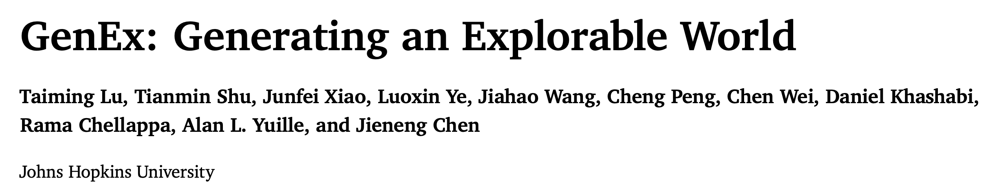

[Homepage](https://genex.world/)

<p align="center">

</p>


<!-- 简介 -->
在3D视觉任务中，只要涉及到对3D空间的观测，就需要处理相机内外参，梳理一下。

---

**世界坐标系**：
世界坐标系基于右手定则，大拇指X，食指Y、中指Z，国际惯例用RGB三色表示。
<p align="center">

</p>

---

**相机坐标系**：
一般用3个字母命名，如RUB、LUF、RDF，依次表示相机坐标系XYZ三个轴的方向。容易混淆的是B和F，这里是相对于相机朝向来描述的，沿着相机镜头向拍摄物体的方向是F，反之则是B。

---

**相机参数**:
通常将​外参矩阵​定义为从世界坐标系到相机坐标系的变换矩阵,通常将Pose矩阵​定义为从相机坐标系到世界坐标系的变换矩阵。外参矩阵和 Pose 矩阵是互为逆矩阵的关系。  
相机内参定义为从相机坐标系到像素坐标系的变换矩阵。
---

**Pose矩阵**:
$$Pose = 
\begin{bmatrix}
R & t  \\
0 & 1 \\
\end{bmatrix}$$
其中，旋转矩阵 $$R$$ 是一个 3×3 的正交矩阵，描述了相机的方向（即相机坐标系相对于世界坐标系的旋转）。平移向量 $$t$$ 是一个 3×1 的向量，描述了相机的位置（即相机坐标系原点在世界坐标系中的坐标）。

---

**Pose矩阵中的旋转矩阵$$R$$**:
$$
R = 
\begin{bmatrix}
r11 & r12 & r13 \\
r21 & r22 & r23 \\
r31 & r32 & r33 \\
\end{bmatrix}
$$，
旋转矩阵 R 的每一列分别对应相机局部坐标系的三个基向量在世界坐标系中的表示。

- ​第一列：$$r=(r11 ,r21,r31)$$, 相机局部坐标系的 ​右向向量（Right）​​ 在世界坐标系中的表示, 相机局部坐标系的 X 轴方向。 

- ​第二列：$$u=(r12,r22,r32)$$, 相机局部坐标系的 ​上向向量（Up）​​ 在世界坐标系中的表示, 相机局部坐标系的 Y 轴方向。 

- ​第三列：$$f=(r13,r23,r33)$$, 相机局部坐标系的 ​前向向量（Forward）​​ 在世界坐标系中的表示, 相机局部坐标系的 Z 轴方向。

---

**相机内参**:
$$
Intrisic = 
\begin{bmatrix}
focal_x & 1 & principal_x \\
1 & focal_y & principal_y \\
1 & 1 & 1 \\
\end{bmatrix}
$$，
$$focal_x$$、$$focal_y$$分别是水平向和垂直向的焦距，$$principal_x$$、$$principal_y$$分别是水平向和垂直向图片中心点的像素坐标，通常是图片宽高的一半。  
分辨率缩放:当图像缩放时，内参矩阵的第一行和第二行乘以缩放系数。


---


# 实际应用中如何处理相机坐标系
## 常见相机坐标系： 

<p align="center">

</p> 

RUB: Meshlab、NeRF、OpenGL、Blender 

RDF: OpenCV、Colmap 

LUF: Pytorch3D、Mitsuba 

DRB: LLFF 

上述都是右手坐标系，意味着$$z = x \times y$$, $$x = y \times z$$, $$y = z \times x$$


**Pytorch3D**：

在 PyTorch3D 中指定相机位姿R、T做渲染时，使用的是 world2camera（w2c）矩阵。

旋转矩阵使用行主序（row-major）矩阵，通常在使用（numpy、colmap、opengl）时采用列主序（column-major）矩阵。设置渲染相机旋转矩阵 R 时，须转换为行主序矩阵。


Pytorch3D设置相机的方式：
`look_at_view_transform(distance, elevation, azimuth)`:这个函数设置的相机看向世界坐标系原点，azimuth是沿着z轴正向向x轴正向旋转的角度,elevation是沿着x轴正向向y轴正向旋转的角度  
```python
R, T = look_at_view_transform(2.7, 0, 180) 
cameras = FoVPerspectiveCameras(device=device, R=R, T=T)
```
<p align="center">

</p>

## 相机坐标系的读取
### Colmap
```python
# 首先利用Colmap官方的python接口read_model()读取相机参数
# 包括图像的名字、图像的分辨率，相机的内参，还有world-to-camera (w2c)矩阵
def read_cameras_from_sparse(sparse_path):
    cameras, images, points3D = read_model(sparse_path, ext='.bin')
    cameras_info = []
    for image in images.values():
        cam_info = {}
        camera = cameras[1]
        cam_info['img_name'] = image.name

        cam_info['intrinsics'] = camera.params
        cam_info['H'] = camera.height
        cam_info['W'] = camera.width

        w2c = torch.eye(4)
        w2c[:3, :3] = torch.FloatTensor(qvec2rotmat(image.qvec))
        w2c[:3, 3] = torch.FloatTensor(image.tvec)
        cam_info['w2c'] = w2c
        cameras_info.append(cam_info)
    return cameras_info
cameras = colmap_utils.read_cameras_from_sparse(args.colmap_sparse_dir)
```


## 相机坐标系间如何转换
### Example: Colmap 到 Pytorch3D

```python
# 已知colmap下的相机外参矩阵w2c
# 获取相机的pose矩阵，即c2w矩阵
c2w = torch.inverse(w2c)
# 获取相机朝向的旋转矩阵R和相机位置的平移向量t
R, t = c2w[:3, :3], c2w[:3, 3:]
# 在pose矩阵上完成两个相机坐标系旋转矩阵的变换，from RDF to LUF for Rotation
# 注意变换的时候只需要对Pose_R矩阵做处理，而Pose_t描述的是相机光心的世界坐标，不会受到相机观测方向的影响
R = torch.stack([-R[:, 0], -R[:, 1], R[:, 2]], 1) 
# 获取新坐标系下的pose矩阵和外参矩阵
new_c2w = torch.cat([R, t], 1)
w2c = torch.linalg.inv(torch.cat((new_c2w, torch.Tensor([[0,0,0,1]])), 0))
# 变成行主序 
R, T = w2c[:3, :3].permute(1, 0), w2c[:3, 3] # convert R to row-major matrix
R = R[None] # batch 1 for rendering
T = T[None] # batch 1 for rendering
```


## 如何自定义设置相机外参
> **叉积的右手定则**:伸出右手，四指指向第一个向量 a 的方向。弯曲四指，使其指向第二个向量 b 的方向。大拇指的方向就是叉积 a×b 的方向。

Example：现有一个ply格式的点云，需要设置虚拟相机基于Pytorch3d对其进行渲染，首先将该点云放入meshlab中进行观测。代码如下：

```python
# 首先在meshlab中确定Forward，沿着世界坐标系的x轴正向看，即（1，0，0）
forward = np.array([1,0,0])
# 然后确定Up，沿着z轴正向，即（0,0,1）
up = np.array([0,0,1])
# 由于LUF坐标系，根据叉乘计算Left
left = np.cross(up, forward)
left = left / np.linalg.norm(left)
# 由于pytorch3d就是luf，这里直接构造一个luf的pose矩阵
R = np.column_stack((left, up, forward))
R = torch.tensor(R, dtype=torch.float32)
# 确定相机的观测位置，这里放在世界坐标系原点，即（0，0，0）
t = torch.tensor([0, 0., 0], dtype=torch.float32)
# 获取相机Pose矩阵，即C2W
C2W = torch.eye(4)
C2W[:3, :3] = R
C2W[:3, 3] = t
# Pose矩阵取逆得到相机外参矩阵，即W2C
C2W = C2W.unsqueeze(0)
w2c = torch.linalg.inv(C2W)
# 从外参矩阵获取Pytorch3d渲染输入的R，t分量
R = w2c[:, :3, :3].permute(0, 2, 1)
t = w2c[:, :3, 3]
# 这里R转为行主序
R = R.permute(0, 2, 1)
# 设置pytorch3d的相机，比如采用FoVPerspectiveCameras
cameras = FoVPerspectiveCameras(fov=fov, device=cfg.device, R=R, T=T)
```

**参考**

[知乎-陈冠英-PyTorch3D渲染COLMAP重建的物体](https://zhuanlan.zhihu.com/p/651937759) 
